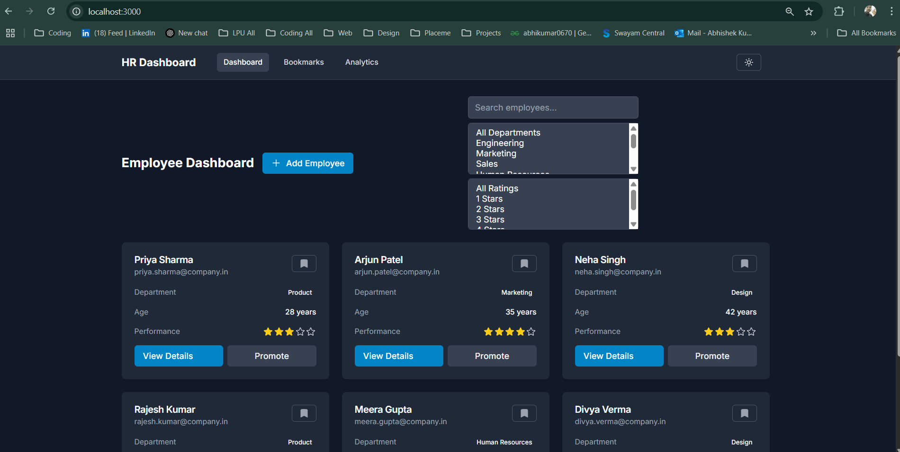
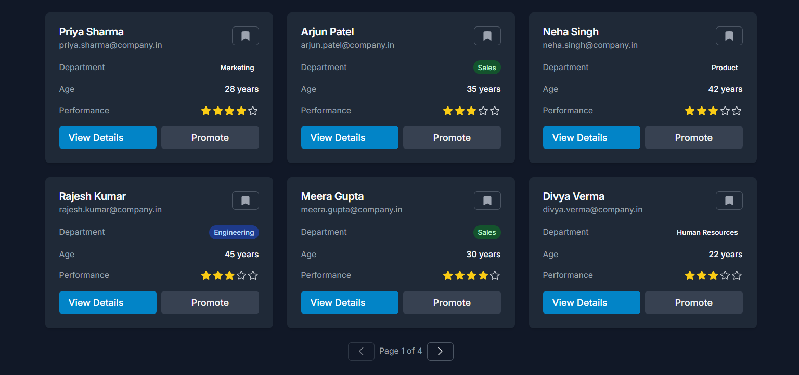
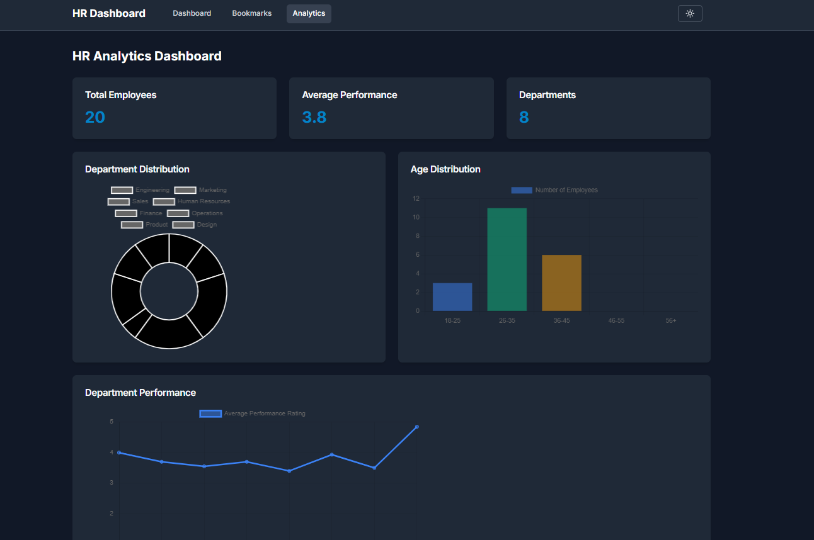
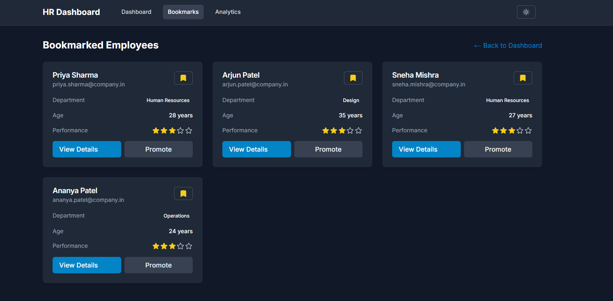

# HR Performance Dashboard

A modern HR Performance Dashboard built with Next.js, Tailwind CSS, and Zustand for state management. This application helps HR professionals manage employee data, track performance, and make data-driven decisions.



## Features Implemented

### Core Features
- 📊 **Employee Dashboard**
  - View all employees in a grid layout
  - Search and filter employees by name, department, and performance rating
  - Bookmark favorite employees for quick access
  - Promote employees with a single click
  - Add new employees through a modal form

- 👤 **Employee Details**
  - Comprehensive employee profile view
  - Performance history with interactive charts
  - Current projects with progress tracking
  - Performance feedback from different reviewers
  - Bookmark and promotion actions

- 📈 **Analytics Page**
  - Key metrics overview (total employees, average performance, departments)
  - Department distribution chart
  - Age distribution visualization
  - Department performance comparison
  - Detailed statistics table

- 🔖 **Bookmarks Manager**
  - Quick access to bookmarked employees
  - Grid view of favorite employees
  - Easy navigation to employee details
  - Toggle bookmark status

### Technical Features
- 🎨 Modern UI with Tailwind CSS
- 📱 Fully responsive design
- ⚡ Server-side rendering with Next.js
- 🔄 Real-time state management with Zustand
- 📊 Interactive charts with Chart.js
- ✨ Smooth animations with Framer Motion
- 🔍 Advanced search and filtering
- 📄 Pagination for better performance

## Screenshots

### Dashboard View

*Main dashboard with employee grid and filters*

### Employee Details

*Detailed employee profile with performance metrics*

### Analytics

*Analytics dashboard with charts and metrics*

### Bookmarks

*Bookmarked employees view*

## Setup Instructions

1. **Clone the repository**
   ```bash
   git clone https://github.com/abhikumar0670/hr-performance-dashboard.git
   cd hr-performance-dashboard
   ```

2. **Install dependencies**
   ```bash
   npm install
   ```

3. **Run the development server**
   ```bash
   npm run dev
   ```

4. **Open the application**
   Open [http://localhost:3000](http://localhost:3000) in your browser

## Tech Stack

- **Framework:** Next.js 14
- **Styling:** Tailwind CSS
- **State Management:** Zustand
- **Charts:** Chart.js with react-chartjs-2
- **Animations:** Framer Motion
- **Icons:** Heroicons
- **API:** DummyJSON (for demo data)

## Project Structure

```
src/
├── app/                    # Next.js app directory
│   ├── analytics/         # Analytics page
│   ├── bookmarks/         # Bookmarks page
│   ├── employee/          # Employee details page
│   └── page.tsx           # Dashboard page
├── components/            # React components
│   ├── modals/           # Modal components
│   └── ui/               # UI components
├── lib/                  # Utility functions
├── store/                # Zustand store
└── types/                # TypeScript types
```

## Contributing

Feel free to submit issues and enhancement requests!

## License

This project is licensed under the MIT License - see the [LICENSE](LICENSE) file for details.

## Author

Abhishek Kumar
- GitHub: [@abhikumar0670](https://github.com/abhikumar0670)
- Email: abhikumar0670@gmail.com 